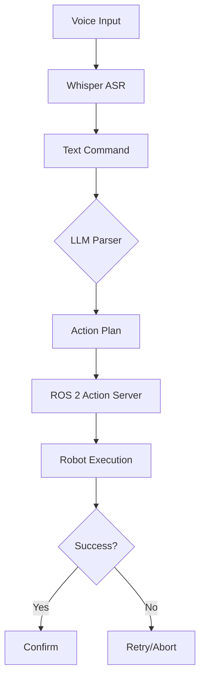

# Physical AI & Humanoid Robotics Data Model

**Feature**: Physical AI & Humanoid Robotics Book Content
**Purpose**: Define structured schemas for all content types
**Created**: 2025-12-11
**Last Updated**: 2025-12-11
**Version**: 1.0.0

---

## 1. Overview

This document defines the structured schemas, templates, and data models for all content in the Physical AI & Humanoid Robotics book. These schemas ensure consistency, enable validation, and facilitate automated content generation.

**Scope:**
- Chapter structure and front matter
- Code example formats
- Diagram specifications
- Hardware specification tables
- Citation formats
- Metadata schemas

---

## 2. Chapter Schema

### 2.1 Chapter Front Matter

All chapters must include Docusaurus-compatible front matter:

```yaml
---
id: unique-chapter-id
title: Chapter Title
sidebar_label: Short Title
sidebar_position: 1
description: Brief description for SEO and previews
keywords: [keyword1, keyword2, keyword3]
---
```

**Field Specifications:**

| Field | Type | Required | Description | Example |
|-------|------|----------|-------------|---------|
| `id` | string | Yes | Unique identifier (kebab-case) | `introduction-physical-ai` |
| `title` | string | Yes | Full chapter title | `Introduction to Physical AI` |
| `sidebar_label` | string | No | Shorter label for sidebar | `Intro to Physical AI` |
| `sidebar_position` | integer | Yes | Order in navigation (1-based) | `1` |
| `description` | string | Yes | SEO description (150-160 chars) | `Learn about physical AI...` |
| `keywords` | array | Yes | SEO keywords (5-10 terms) | `[physical-ai, robotics, ros2]` |

### 2.2 Chapter Structure Template

```markdown
---
id: chapter-id
title: Chapter Title
sidebar_label: Short Title
sidebar_position: 1
description: Brief description
keywords: [keyword1, keyword2, keyword3]
---

# Chapter Title

:::info Learning Objectives
By the end of this chapter, you will:
- Objective 1
- Objective 2
- Objective 3
:::

## Section 1: Introduction

[Content here - establish context, motivation, overview]

## Section 2: Core Concepts

[Main technical content]

### Subsection 2.1

[Detailed explanation]

### Subsection 2.2

[Detailed explanation]

## Section 3: Practical Example

[Hands-on tutorial or walkthrough]

```python
# Code example
import rclpy
from rclpy.node import Node

class ExampleNode(Node):
    def __init__(self):
        super().__init__('example_node')
        self.get_logger().info('Node initialized')

def main():
    rclpy.init()
    node = ExampleNode()
    rclpy.spin(node)
    rclpy.shutdown()
```

## Section 4: Best Practices

:::tip Best Practice
[Highlight important recommendations]
:::

:::warning Common Pitfall
[Warn about common mistakes]
:::

## Section 5: Summary

[Recap key points, transition to next chapter]

:::note Key Takeaways
- Takeaway 1
- Takeaway 2
- Takeaway 3
:::

## Further Reading

- [Source 1 Title](URL) - Description
- [Source 2 Title](URL) - Description

---

**Next**: [Next Chapter Title](./next-chapter.md)
```

**Required Elements:**
- Learning objectives callout at the beginning
- 3-5 main sections with clear headings
- At least one code example or diagram
- Best practices and warnings where appropriate
- Summary with key takeaways
- Links to next chapter

---

## 3. Code Example Schema

### 3.1 Python Code Block

```python
# [Brief description of what this code does]
# File: package_name/node_name.py

import rclpy
from rclpy.node import Node
from std_msgs.msg import String

class ExampleNode(Node):
    """
    Brief description of the node's purpose.

    Attributes:
        publisher_: Publisher for topic_name
    """

    def __init__(self):
        super().__init__('example_node')

        # Create publisher
        self.publisher_ = self.create_publisher(
            String,
            'topic_name',
            10  # Queue size
        )

        # Create timer (1 Hz)
        self.timer = self.create_timer(1.0, self.timer_callback)

    def timer_callback(self):
        """Publish message every timer tick."""
        msg = String()
        msg.data = 'Hello from ROS 2'
        self.publisher_.publish(msg)
        self.get_logger().info(f'Publishing: "{msg.data}"')

def main(args=None):
    rclpy.init(args=args)
    node = ExampleNode()

    try:
        rclpy.spin(node)
    except KeyboardInterrupt:
        pass
    finally:
        node.destroy_node()
        rclpy.shutdown()

if __name__ == '__main__':
    main()
```

**Code Block Standards:**

| Element | Required | Description |
|---------|----------|-------------|
| File comment | Yes | Brief description and file path |
| Imports | Yes | All necessary imports listed |
| Docstrings | Yes | Class and method docstrings |
| Inline comments | As needed | For complex logic only |
| Error handling | Recommended | Try/except for robustness |
| Main guard | Yes (for scripts) | `if __name__ == '__main__'` |

### 3.2 URDF/XML Code Block

```xml
<!-- Robot description file -->
<!-- File: robot_description/urdf/robot.urdf -->

<?xml version="1.0"?>
<robot name="example_robot">

  <!-- Base link -->
  <link name="base_link">
    <visual>
      <geometry>
        <box size="0.5 0.3 0.1"/>
      </geometry>
      <material name="blue">
        <color rgba="0 0 0.8 1"/>
      </material>
    </visual>
    <collision>
      <geometry>
        <box size="0.5 0.3 0.1"/>
      </geometry>
    </collision>
    <inertial>
      <mass value="10.0"/>
      <inertia ixx="0.1" ixy="0" ixz="0" iyy="0.1" iyz="0" izz="0.1"/>
    </inertial>
  </link>

  <!-- Additional links and joints... -->

</robot>
```

**XML Standards:**
- Proper indentation (2 spaces)
- Opening comments with file path
- All required URDF elements (visual, collision, inertial)

### 3.3 YAML Configuration Block

```yaml
# Nav2 configuration example
# File: config/nav2_params.yaml

bt_navigator:
  ros__parameters:
    use_sim_time: True
    global_frame: map
    robot_base_frame: base_link
    odom_topic: /odom
    bt_loop_duration: 10
    default_server_timeout: 20

controller_server:
  ros__parameters:
    use_sim_time: True
    controller_frequency: 20.0
    min_x_velocity_threshold: 0.001
    min_y_velocity_threshold: 0.5
    min_theta_velocity_threshold: 0.001
```

**YAML Standards:**
- Opening comment with file path
- Proper indentation (2 spaces)
- Meaningful parameter names
- Comments for non-obvious values

---

## 4. Diagram Schema

### 4.1 Mermaid Flowchart

````markdown

````

**Mermaid Diagram Types:**

| Type | Use Case | Syntax Prefix |
|------|----------|---------------|
| Flowchart | Process flows, pipelines | `flowchart TD` |
| Sequence | Message passing, interactions | `sequenceDiagram` |
| Class | Architecture, components | `classDiagram` |
| State | State machines, modes | `stateDiagram-v2` |

**Flowchart Standards:**
- Use descriptive node labels
- Show decision points with diamonds
- Indicate success/failure paths
- Keep complexity manageable (<15 nodes)

### 4.2 ASCII Diagram

```
Robot System Architecture
=========================

┌─────────────────────────────────────────────────────────┐
│                     High-Level Control                  │
│  ┌──────────┐  ┌──────────┐  ┌──────────────────────┐  │
│  │  Whisper │→ │   LLM    │→ │   Task Planner       │  │
│  └──────────┘  └──────────┘  └──────────────────────┘  │
└──────────────────────────┬──────────────────────────────┘
                           │
                           ↓
┌─────────────────────────────────────────────────────────┐
│                      ROS 2 Middleware                   │
│  ┌──────────┐  ┌──────────┐  ┌──────────────────────┐  │
│  │   Nav2   │  │  MoveIt  │  │  Perception Pipeline │  │
│  └──────────┘  └──────────┘  └──────────────────────┘  │
└──────────────────────────┬──────────────────────────────┘
                           │
                           ↓
┌─────────────────────────────────────────────────────────┐
│                   Hardware Interface                    │
│  ┌──────────┐  ┌──────────┐  ┌──────────────────────┐  │
│  │  Motors  │  │ Sensors  │  │      Actuators       │  │
│  └──────────┘  └──────────┘  └──────────────────────┘  │
└─────────────────────────────────────────────────────────┘
```

**ASCII Diagram Standards:**
- Use box-drawing characters: ┌ ─ ┐ │ └ ┘ ┬ ┴ ├ ┤ ┼
- Arrows: → ← ↑ ↓ ↔
- Keep width < 80 characters when possible
- Label all major components
- Show hierarchy (top-to-bottom) or flow (left-to-right)

---

## 5. Hardware Specification Table Schema

### 5.1 Robot Specification Table

| Component | Specification | Example Model | Notes |
|-----------|---------------|---------------|-------|
| **Base Platform** | Humanoid, 12+ DOF | Unitree H1 | Full body articulation |
| **Height** | 150-180 cm | 175 cm | Human-scale preferred |
| **Weight** | 30-50 kg | 47 kg | Including batteries |
| **Compute** | GPU-enabled SBC | NVIDIA Jetson AGX Orin | For on-board inference |
| **LiDAR** | 360° scanning, 10+ Hz | Velodyne VLP-16 | SLAM and navigation |
| **Camera** | RGB-D, 30 fps | Intel RealSense D435 | Object detection |
| **IMU** | 6-axis or 9-axis | MPU-9250 | Localization |
| **Battery** | 2+ hours runtime | 48V 10Ah Li-ion | Depends on load |
| **Communication** | Wi-Fi, Ethernet | 802.11ac, GigE | Remote monitoring |

**Table Standards:**
- First column: component name (bold)
- Include: specification, example model, notes
- Use specific units (cm, kg, Hz, fps)
- Provide realistic examples
- Note tradeoffs in Notes column

### 5.2 Software Dependency Table

| Software | Version | Purpose | Installation |
|----------|---------|---------|--------------|
| ROS 2 | Humble+ | Robot framework | `apt install ros-humble-desktop` |
| Gazebo | Fortress+ | Simulation | `apt install gz-fortress` |
| Python | 3.8+ | Scripting | Included in Ubuntu 22.04 |
| Nav2 | Latest | Navigation stack | `apt install ros-humble-navigation2` |
| MoveIt 2 | Latest | Manipulation | `apt install ros-humble-moveit` |
| Whisper | 1.0+ | Speech recognition | `pip install openai-whisper` |

**Dependency Table Standards:**
- Include version requirements
- Provide installation command
- Note OS/platform requirements if applicable
- Link to official documentation

---

## 6. Citation Schema

### 6.1 MLA Format

**Journal Article:**
```
Author(s). "Article Title." Journal Name, vol. X, no. Y, Year, pp. XX-YY. DOI or URL.
```

**Book:**
```
Author(s). Book Title. Publisher, Year.
```

**Website:**
```
Author(s) or Organization. "Page Title." Website Name, Publication Date, URL. Accessed Date.
```

**Documentation:**
```
Organization. "Documentation Page Title." Product Name Documentation, Version, Year, URL. Accessed Date.
```

**Example:**
```
Open Robotics. "ROS 2 Concepts." ROS 2 Documentation, Humble, 2023, https://docs.ros.org/en/humble/Concepts.html. Accessed 11 Dec. 2025.
```

### 6.2 APA Format

**Journal Article:**
```
Author(s). (Year). Article title. Journal Name, Volume(Issue), pages. DOI or URL
```

**Book:**
```
Author(s). (Year). Book title. Publisher.
```

**Website:**
```
Author(s) or Organization. (Year, Month Day). Page title. Site Name. URL
```

**Documentation:**
```
Organization. (Year). Documentation page title. Product Name Documentation. URL
```

**Example:**
```
Open Robotics. (2023). ROS 2 Concepts. ROS 2 Documentation. https://docs.ros.org/en/humble/Concepts.html
```

### 6.3 Citation Placement

**Inline Citation:**
```markdown
According to the ROS 2 documentation, nodes are the fundamental building blocks (Open Robotics, 2023).
```

**Reference List:**
All citations must appear in a "References" or "Further Reading" section at the end of each chapter.

---

## 7. Callout Schema

Docusaurus provides several callout types:

### 7.1 Note

```markdown
:::note
This is a general note providing additional context or clarification.
:::
```

**Use For**: Supplementary information, clarifications, side notes

### 7.2 Tip

```markdown
:::tip Best Practice
Always test your ROS 2 nodes in simulation before deploying to hardware.
:::
```

**Use For**: Best practices, recommendations, optimization tips

### 7.3 Info

```markdown
:::info Learning Objectives
By the end of this chapter, you will understand ROS 2 nodes and topics.
:::
```

**Use For**: Learning objectives, key information, prerequisites

### 7.4 Warning

```markdown
:::warning Common Pitfall
Forgetting to source your ROS 2 workspace will cause "package not found" errors.
:::
```

**Use For**: Common mistakes, things to avoid, important caveats

### 7.5 Danger

```markdown
:::danger Safety Critical
Never deploy untested code on physical robots. Always use emergency stop procedures.
:::
```

**Use For**: Safety warnings, critical errors, destructive operations

---

## 8. Metadata Schema

### 8.1 Chapter Metadata

```yaml
chapter:
  id: "chapter-slug"
  title: "Full Chapter Title"
  number: 1
  category: "intro" # intro, architecture, modules, workflows, appendix
  word_count: 1250
  estimated_reading_time: "8 minutes"
  difficulty: "beginner" # beginner, intermediate, advanced
  prerequisites:
    - "Basic Python knowledge"
    - "Linux command line familiarity"
  learning_objectives:
    - "Understand what Physical AI means"
    - "Identify key components of embodied AI systems"
  code_examples:
    - language: "python"
      lines: 45
      tested: true
    - language: "yaml"
      lines: 20
      tested: true
  diagrams:
    - type: "mermaid"
      diagram_type: "flowchart"
      description: "Physical AI system overview"
  citations:
    - "Open Robotics, 2023"
    - "NVIDIA, 2024"
  last_updated: "2025-12-11"
  status: "draft" # draft, review, complete
```

### 8.2 Code Example Metadata

```yaml
code_example:
  id: "ros2-publisher-example"
  language: "python"
  file_path: "examples/ros2_basics/publisher.py"
  description: "Simple ROS 2 publisher node"
  tested: true
  test_environment:
    ros_version: "Humble"
    os: "Ubuntu 22.04"
    python_version: "3.10"
  dependencies:
    - "rclpy"
    - "std_msgs"
  lines_of_code: 45
  complexity: "beginner"
```

---

## 9. Validation Rules

### 9.1 Chapter Validation

**Required Checks:**
- [ ] Front matter present and complete
- [ ] Word count within range (800-2000)
- [ ] At least one code example or diagram
- [ ] Learning objectives stated
- [ ] Summary and key takeaways included
- [ ] All code blocks have language tags
- [ ] All citations formatted correctly
- [ ] All internal links resolve
- [ ] Flesch-Kincaid grade 8-12

### 9.2 Code Validation

**Required Checks:**
- [ ] Syntactically correct
- [ ] Includes necessary imports
- [ ] Follows style guide (PEP 8 for Python)
- [ ] Includes docstrings
- [ ] Tested in specified environment
- [ ] Error handling present (where appropriate)

### 9.3 Diagram Validation

**Required Checks:**
- [ ] Renders correctly in Docusaurus
- [ ] Labels are clear and readable
- [ ] Complexity is manageable
- [ ] Alt text provided (accessibility)

---

## 10. Template Files

### 10.1 Chapter Template Location

All template files should be stored in:
```
.specify/templates/chapter-template.md
.specify/templates/code-example-template.py
.specify/templates/urdf-template.xml
```

### 10.2 Usage

When creating new chapters:
1. Copy template file
2. Rename according to chapter slug
3. Fill in all placeholder fields
4. Validate against schema
5. Test all code examples

---

## 11. Governance

This data model is governed by:
- **Constitution**: `.specify/memory/constitution.md`
- **Specification**: `specs/physical-ai-robotics/spec.md`
- **Plan**: `specs/physical-ai-robotics/plan.md`

**Data Model Updates:**
- Any schema changes must be documented
- Version bump required for breaking changes
- All existing content must be migrated to new schema
- PHR created for all data model modifications

**Version History:**
- v1.0.0 (2025-12-11): Initial data model created

---

**End of Data Model**
