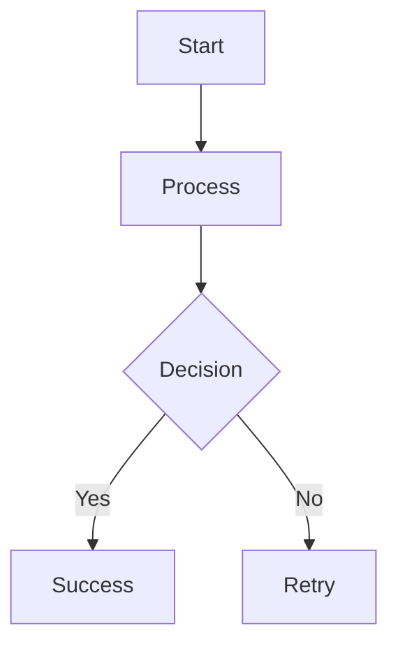

# Physical AI & Humanoid Robotics Project Quickstart

**Feature**: Physical AI & Humanoid Robotics Book Content
**Purpose**: User onboarding guide for contributors and developers
**Created**: 2025-12-11
**Last Updated**: 2025-12-11
**Version**: 1.0.0

---

## 1. Welcome

Welcome to the Physical AI & Humanoid Robotics book project! This guide will help you get started contributing to the book using Spec-Kit Plus, Claude Code, and Docusaurus.

**What You'll Learn:**
- How to set up your development environment
- How to use Spec-Kit Plus for spec-driven development
- How to write and validate chapters
- How to build and deploy the Docusaurus site

**Who This Is For:**
- Technical writers contributing chapters
- Engineers reviewing code examples
- Editors ensuring consistency
- Anyone building the book with Claude Code

---

## 2. Prerequisites

### 2.1 Required Knowledge

- **Intermediate Python**: Understanding of classes, modules, functions
- **Basic Linux/Command Line**: Navigating directories, running commands
- **Git/GitHub**: Cloning repos, committing changes, creating PRs
- **Markdown**: Basic formatting (headings, lists, code blocks)

### 2.2 Optional Knowledge (Helpful)

- ROS 2 experience (for robotics chapters)
- Docusaurus familiarity (for site customization)
- Spec-Kit Plus experience (workflow is documented here)

---

## 3. Setup Instructions

### 3.1 Clone the Repository

```bash
git clone https://github.com/[your-username]/physical-ai-robotics-book.git
cd physical-ai-robotics-book
```

### 3.2 Install Dependencies

**Node.js and npm** (for Docusaurus):
```bash
# Ubuntu/Debian
curl -fsSL https://deb.nodesource.com/setup_18.x | sudo -E bash -
sudo apt-get install -y nodejs

# Verify installation
node --version  # Should be 18.x or later
npm --version
```

**Docusaurus**:
```bash
npm install
```

**Python** (for code examples):
```bash
# Ubuntu 22.04 includes Python 3.10
python3 --version

# Install pip if needed
sudo apt install python3-pip
```

### 3.3 Verify Setup

```bash
# Build the site locally
npm start

# This should open http://localhost:3000 in your browser
```

If the site builds and you see the homepage, you're ready to go!

---

## 4. Project Structure

Understanding the directory layout:

```
physical-ai-robotics-book/
├── .specify/                # Spec-Kit Plus framework
│   ├── memory/              # Constitution and project principles
│   ├── templates/           # Content templates
│   └── scripts/             # Automation scripts
├── docs/                    # Book chapters (Docusaurus content)
│   ├── intro/               # Introduction chapters
│   ├── architecture/        # System design chapters
│   ├── modules/             # ROS 2, Gazebo, Isaac Sim tutorials
│   ├── workflows/           # AI-driven workflows
│   └── appendix/            # Reference materials
├── specs/                   # Spec-Kit Plus specifications
│   └── physical-ai-robotics/
│       ├── spec.md          # Feature specification
│       ├── plan.md          # Project plan
│       ├── data-model.md    # Content schemas
│       ├── research.md      # Source documentation
│       ├── quickstart.md    # This file
│       └── tasks.md         # Implementation tasks (generated)
├── history/                 # Prompt History Records (PHRs)
│   ├── prompts/             # Organized by feature
│   └── adr/                 # Architecture Decision Records
├── src/                     # Docusaurus custom components
├── static/                  # Images, diagrams, assets
├── docusaurus.config.js     # Docusaurus configuration
├── sidebars.js              # Navigation structure
├── package.json             # Node.js dependencies
└── README.md                # Project overview
```

**Key Files to Know:**
- **Constitution**: `.specify/memory/constitution.md` (project principles)
- **Spec**: `specs/physical-ai-robotics/spec.md` (content rules)
- **Plan**: `specs/physical-ai-robotics/plan.md` (execution strategy)
- **Data Model**: `specs/physical-ai-robotics/data-model.md` (schemas)

---

## 5. Spec-Kit Plus Workflow

This project follows **Spec-Driven Development** using Spec-Kit Plus:

### 5.1 The Spec-Driven Process

```
Constitution → Spec → Plan → Tasks → Implementation → Review → Deploy
```

1. **Constitution**: Defines core principles (already created)
2. **Spec**: Defines what to build (already created)
3. **Plan**: Defines how to build (already created)
4. **Tasks**: Breaks work into actionable items (to be generated)
5. **Implementation**: Write chapters following tasks
6. **Review**: Validate against spec and constitution
7. **Deploy**: Build and publish to GitHub Pages

### 5.2 Key Commands

**Generate tasks from plan:**
```bash
/sp.tasks
```

**Create a Prompt History Record (PHR):**
```bash
/sp.phr --title "Chapter Creation" --stage "implementation"
```

**Create an Architecture Decision Record (ADR):**
```bash
/sp.adr "Decision Title"
```

**Check constitution compliance:**
Review your work against `.specify/memory/constitution.md`

---

## 6. Writing a Chapter

### 6.1 Chapter Workflow

1. **Select a chapter** from `specs/physical-ai-robotics/plan.md`
2. **Review requirements** in `specs/physical-ai-robotics/spec.md`
3. **Copy template** from `.specify/templates/chapter-template.md`
4. **Write content** following data model in `data-model.md`
5. **Validate** against acceptance criteria
6. **Test code** (if applicable)
7. **Build locally** with `npm start`
8. **Create PHR** documenting your work

### 6.2 Example: Creating "Introduction to Physical AI"

**Step 1: Copy Template**
```bash
cp .specify/templates/chapter-template.md docs/intro/introduction.md
```

**Step 2: Fill in Front Matter**
```yaml
---
id: introduction-physical-ai
title: Introduction to Physical AI
sidebar_label: Intro to Physical AI
sidebar_position: 1
description: Learn what Physical AI is and why it matters for robotics
keywords: [physical-ai, embodied-ai, robotics, autonomous-systems]
---
```

**Step 3: Write Content**
- Follow the template structure
- Include learning objectives
- Add at least one diagram or code example
- Cite all technical claims
- Include summary and key takeaways

**Step 4: Validate**
- Word count: 800-2000 ✓
- Code tested: N/A (no code in intro chapter) ✓
- Citations formatted: MLA ✓
- Build succeeds: `npm start` ✓

**Step 5: Create PHR**
```bash
/sp.phr --title "Introduction Chapter Created" --stage "implementation" --feature "physical-ai-robotics"
```

---

## 7. Working with Code Examples

### 7.1 Code Example Guidelines

All code must:
- Be syntactically correct
- Include necessary imports
- Follow style guides (PEP 8 for Python)
- Include docstrings and comments
- Be tested in the specified environment

### 7.2 Testing ROS 2 Examples

**Setup ROS 2 Environment:**
```bash
# Install ROS 2 Humble (Ubuntu 22.04)
sudo apt install ros-humble-desktop

# Source the workspace
source /opt/ros/humble/setup.bash

# Create a test workspace
mkdir -p ~/test_ws/src
cd ~/test_ws
colcon build
source install/setup.bash
```

**Test Your Code:**
```bash
# Create a test package
cd ~/test_ws/src
ros2 pkg create --build-type ament_python my_test_package

# Copy your example code
cp [your-example].py ~/test_ws/src/my_test_package/my_test_package/

# Build and run
cd ~/test_ws
colcon build
source install/setup.bash
ros2 run my_test_package [your-node]
```

### 7.3 Code Review Checklist

- [ ] Syntactically correct (no errors)
- [ ] Follows PEP 8 (for Python)
- [ ] Includes docstrings
- [ ] Imports are correct
- [ ] Tested in specified environment (ROS 2 Humble, Ubuntu 22.04)
- [ ] Error handling present (where appropriate)
- [ ] Comments explain complex logic

---

## 8. Building and Previewing

### 8.1 Local Development Server

```bash
# Start development server (hot reload enabled)
npm start

# Open http://localhost:3000
```

Changes to Markdown files will automatically reload the browser.

### 8.2 Production Build

```bash
# Build static site
npm run build

# Serve the built site locally
npm run serve
```

The production build should complete without errors or warnings.

### 8.3 Common Build Issues

**Issue**: "Module not found"
**Solution**: Run `npm install` to ensure all dependencies are installed

**Issue**: "Duplicate sidebar item"
**Solution**: Check `sidebars.js` for duplicate chapter IDs

**Issue**: "Broken link"
**Solution**: Verify all internal links use correct relative paths

---

## 9. Creating Diagrams

### 9.1 Mermaid Diagrams

Docusaurus supports Mermaid diagrams natively:

````markdown

````

**Diagram Types:**
- Flowchart: Process flows
- Sequence: Message passing
- Class: System architecture
- State: State machines

### 9.2 ASCII Diagrams

For simple diagrams, use ASCII art:

```
System Architecture
===================

┌──────────┐
│   User   │
└────┬─────┘
     │
     ↓
┌──────────┐
│  Robot   │
└──────────┘
```

### 9.3 Images

- Place images in `static/img/`
- Reference with: ``
- Optimize images (<500KB)
- Always include alt text for accessibility

---

## 10. Citation Guidelines

### 10.1 When to Cite

Cite sources for:
- Technical specifications (APIs, protocols)
- Algorithms and methods
- Hardware specifications
- Research claims
- Statistical data

### 10.2 Citation Format

**MLA (Preferred):**
```
Author(s). "Title." Source, Date, URL. Accessed Date.
```

**Example:**
```
Open Robotics. "ROS 2 Concepts." ROS 2 Documentation, 2023, https://docs.ros.org/en/humble/Concepts.html. Accessed 11 Dec. 2025.
```

### 10.3 In-Text Citations

```markdown
According to the ROS 2 documentation, nodes are the fundamental building blocks of ROS systems (Open Robotics, 2023).
```

### 10.4 Reference Section

Include a "References" or "Further Reading" section at the end of each chapter:

```markdown
## References

- Open Robotics. "ROS 2 Concepts." ROS 2 Documentation, 2023, https://docs.ros.org/en/humble/Concepts.html. Accessed 11 Dec. 2025.
- NVIDIA. "Isaac Sim Introduction." Isaac Sim Documentation, 2023, https://docs.omniverse.nvidia.com/isaacsim/latest/index.html. Accessed 11 Dec. 2025.
```

---

## 11. Quality Checklist

Before submitting a chapter:

### 11.1 Content Quality

- [ ] Word count: 800-2000 words
- [ ] Learning objectives stated clearly
- [ ] Technical claims cited with authoritative sources
- [ ] Consistent terminology (check glossary in `research.md`)
- [ ] Clear explanations suitable for intermediate-advanced learners
- [ ] Summary and key takeaways included

### 11.2 Code Quality

- [ ] All code syntactically correct
- [ ] Code tested in specified environment
- [ ] Includes necessary imports and dependencies
- [ ] Follows style guides (PEP 8 for Python)
- [ ] Includes docstrings and comments
- [ ] Error handling present (where appropriate)

### 11.3 Format and Style

- [ ] Front matter complete (id, title, sidebar_position, etc.)
- [ ] Headings follow proper hierarchy (h1 → h2 → h3)
- [ ] Code blocks have language tags
- [ ] Images have alt text
- [ ] Callouts used appropriately (:::tip, :::warning, etc.)
- [ ] Links are valid and formatted correctly

### 11.4 Build and Deploy

- [ ] Docusaurus builds without errors: `npm run build`
- [ ] No broken links
- [ ] All images load correctly
- [ ] Navigation works as expected
- [ ] Site renders correctly on mobile and desktop

---

## 12. Contribution Workflow

### 12.1 Git Workflow

1. **Create a feature branch:**
```bash
git checkout -b feature/intro-chapter
```

2. **Make your changes:**
```bash
# Edit files
# Test locally (npm start)
```

3. **Commit your changes:**
```bash
git add docs/intro/introduction.md
git commit -m "feat: add introduction to physical AI chapter"
```

4. **Push to GitHub:**
```bash
git push origin feature/intro-chapter
```

5. **Create a Pull Request:**
- Go to GitHub repository
- Click "New Pull Request"
- Describe your changes
- Request review

### 12.2 Commit Message Format

Follow conventional commits:

```
<type>: <description>

[optional body]
```

**Types:**
- `feat`: New chapter or feature
- `fix`: Bug fix or correction
- `docs`: Documentation updates
- `refactor`: Code restructuring
- `test`: Adding tests
- `chore`: Maintenance tasks

**Examples:**
```
feat: add SLAM and navigation chapter
fix: correct ROS 2 code example in chapter 3
docs: update quickstart with new setup steps
```

### 12.3 Pull Request Template

```markdown
## Description
[Brief description of changes]

## Checklist
- [ ] Content follows spec and constitution
- [ ] Code tested and validated
- [ ] Build succeeds locally
- [ ] PHR created
- [ ] Citations formatted correctly

## Related Issues
Closes #[issue-number]
```

---

## 13. Common Tasks

### 13.1 Add a New Chapter

```bash
# 1. Create chapter file
cp .specify/templates/chapter-template.md docs/[section]/[chapter-name].md

# 2. Edit front matter and content

# 3. Update sidebars.js
# Add chapter to appropriate section

# 4. Test build
npm start

# 5. Create PHR
/sp.phr --title "New Chapter Created" --stage "implementation"
```

### 13.2 Fix a Broken Link

```bash
# 1. Identify broken link in build output
npm run build

# 2. Fix the link in the source Markdown file
# Use relative paths: ./chapter.md or ../section/chapter.md

# 3. Verify fix
npm run build
```

### 13.3 Update Citation Format

```bash
# 1. Review research.md for correct format

# 2. Update citations in chapter

# 3. Verify consistency
# All citations should follow same format (MLA or APA)
```

---

## 14. Getting Help

### 14.1 Documentation

- **Constitution**: `.specify/memory/constitution.md` - Core principles
- **Spec**: `specs/physical-ai-robotics/spec.md` - Content rules
- **Plan**: `specs/physical-ai-robotics/plan.md` - Project roadmap
- **Data Model**: `specs/physical-ai-robotics/data-model.md` - Schemas and templates
- **Research**: `specs/physical-ai-robotics/research.md` - Sources and citations

### 14.2 Resources

- **Docusaurus Docs**: https://docusaurus.io/docs
- **ROS 2 Docs**: https://docs.ros.org
- **Spec-Kit Plus**: (Internal framework documentation)
- **Markdown Guide**: https://www.markdownguide.org

### 14.3 Questions?

- **GitHub Issues**: Report bugs or ask questions
- **Pull Request Comments**: Discuss specific changes
- **Project Maintainers**: Contact via GitHub

---

## 15. Next Steps

Now that you're set up:

1. **Review the Constitution** (`.specify/memory/constitution.md`)
2. **Read the Specification** (`specs/physical-ai-robotics/spec.md`)
3. **Check the Plan** (`specs/physical-ai-robotics/plan.md`)
4. **Pick a chapter** from the plan
5. **Start writing!**

**First-Time Contributors:**
Start with a small chapter (800-1000 words) to get familiar with the workflow. The appendix sections are good first contributions.

**Experienced Contributors:**
Take on more complex chapters like VLA models or the capstone project.

---

## 16. Governance

This quickstart guide is governed by:
- **Constitution**: `.specify/memory/constitution.md`
- **Specification**: `specs/physical-ai-robotics/spec.md`
- **Plan**: `specs/physical-ai-robotics/plan.md`

**Quickstart Updates:**
- Updated as new tools or processes are added
- Version bump for significant workflow changes
- PHR created for major updates

**Version History:**
- v1.0.0 (2025-12-11): Initial quickstart guide created

---

**Welcome aboard! Happy writing! 🤖📚**
